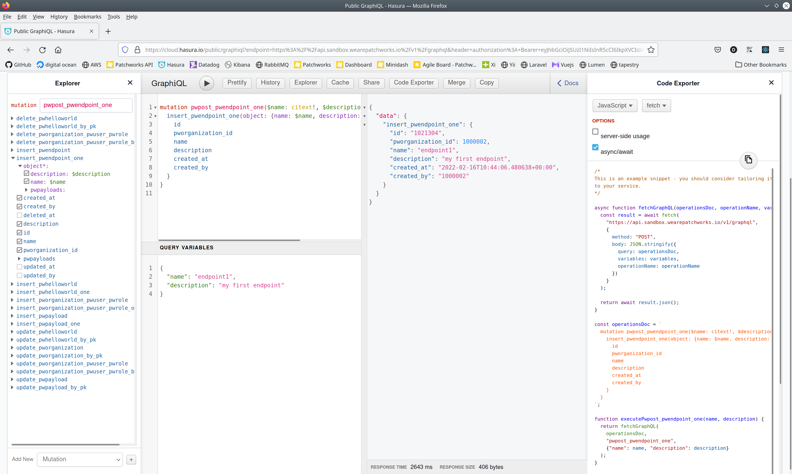
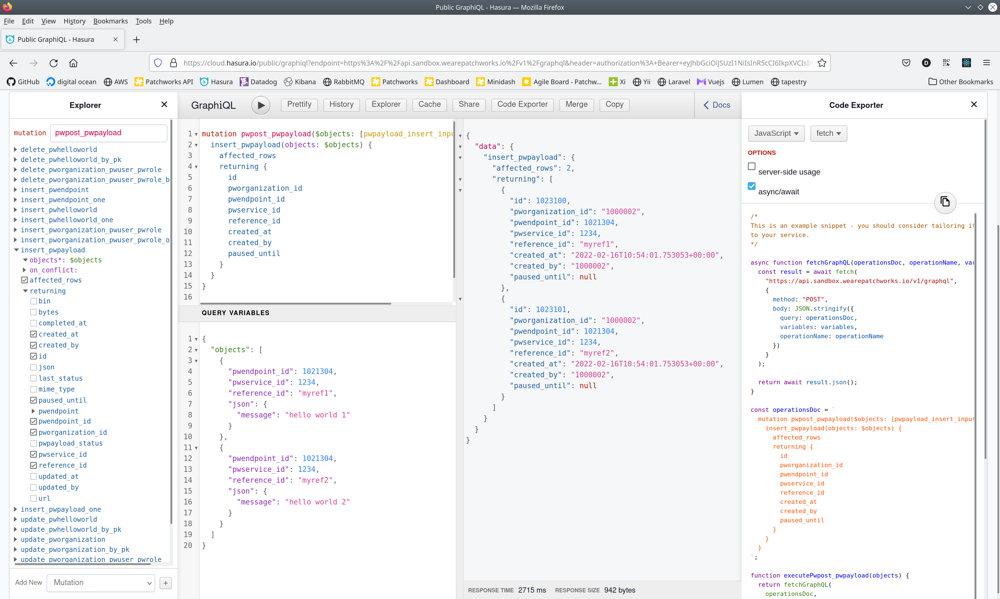

# Patchworks API

Documentation for patchworks Ingest API.

## Table of Contents

- [Introduction](#introduction)
- [Create Endpoint](#create-endpoint)
- [Send Payloads](#send-payloads)

## Introduction

You must first create and endpoint using the service id you receive from our developers. Then you can send payloads to this endpoint. You can send multiple payloads for several services in one request, up to 4MiB. 

You can login to our api sand box to write test your queries https://graphiql.sandbox.wearepatchworks.io/

## Create Endpoint

Write and execute an endpoint mutation.

```graphql
mutation pwpost_pwendpoint_one($name: citext!, $description: citext!) {
  insert_pwendpoint_one(object: {name: $name, description: $description}) {
    id
    pworganization_id
    name
    description
    created_at
    created_by
  }
}
```


```json
{
  "name": "endpoint1",
  "description": "my first endpoint"
}
```




## Send Payloads

Write and execute a payload mutation.

```graphql
mutation pwpost_pwpayload($objects: [pwpayload_insert_input!] = {}) {
  insert_pwpayload(objects: $objects) {
    affected_rows
    returning {
      id
      pworganization_id
      pwendpoint_id
      pwservice_id
      reference_id
      created_at
      created_by
      paused_until
    }
  }
}
```


```json
{
  "objects": [
    {
      "pwendpoint_id": 1021304,
      "pwservice_id": 1234,
      "reference_id": "myref1",
      "json": {
        "message": "hello world 1"
      }
    },
    {
      "pwendpoint_id": 1021304,
      "pwservice_id": 1234,
      "reference_id": "myref2",
      "json": {
        "message": "hello world 2"
      }
    }
  ]
}
```


